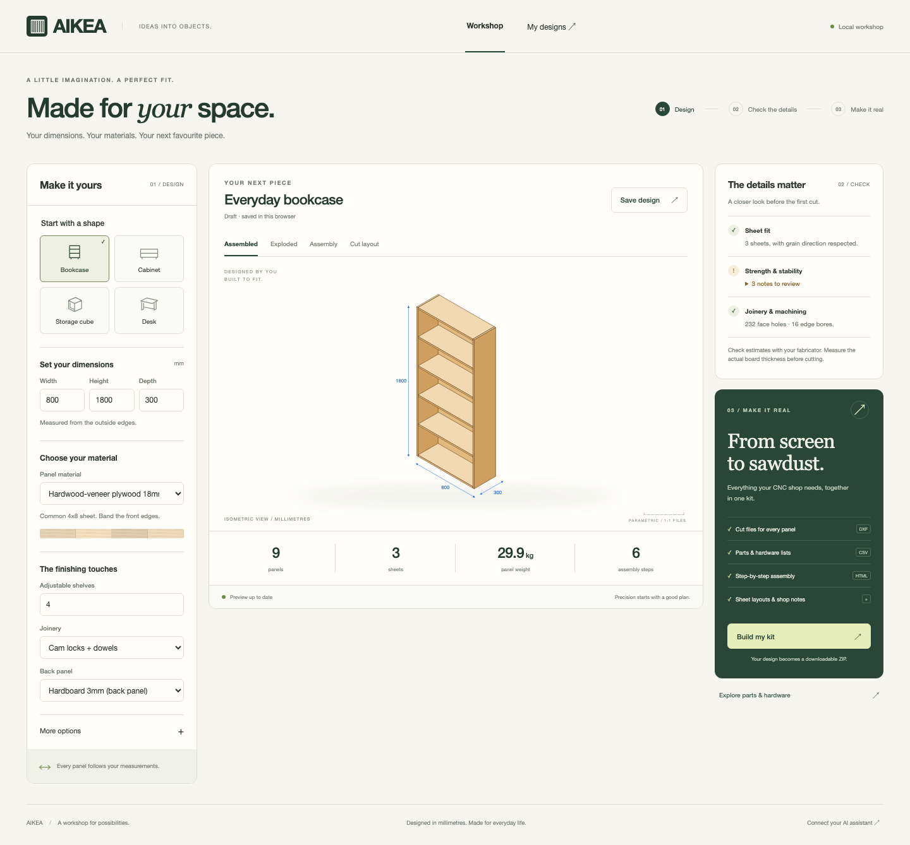
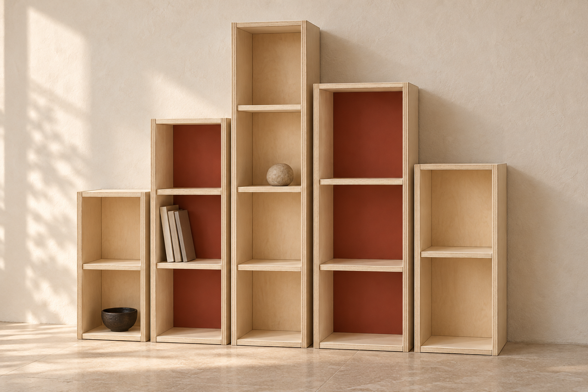
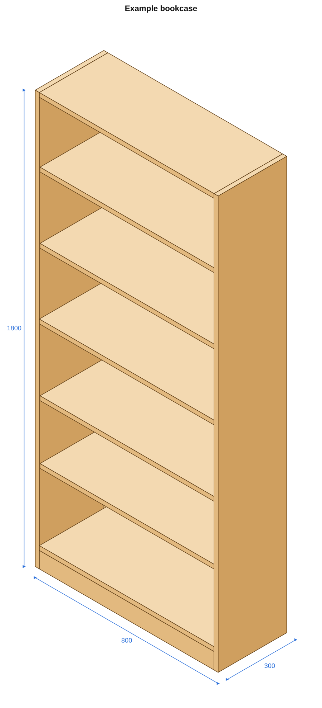
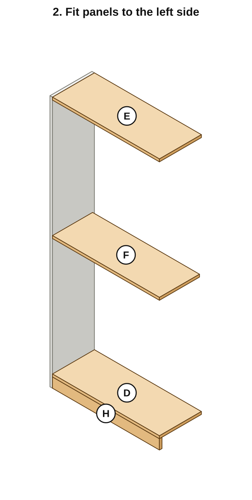
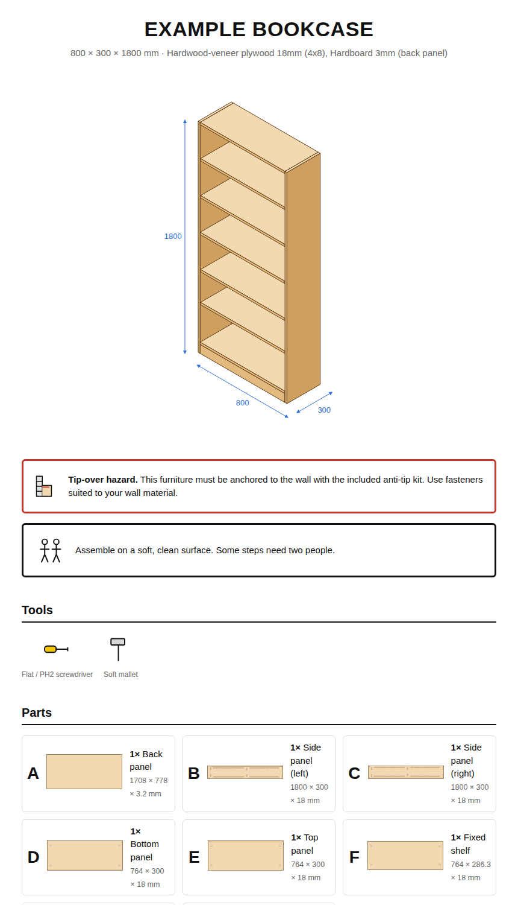

# AIKEA

**Design furniture that fits your space. Take it from a live preview to a kit your CNC shop can cut.**



## Open your workshop

Use Node.js 22.12+ or 24 for development.

```bash
git clone https://github.com/atimics/aikea
cd aikea
npm ci
npm run studio
```

Open **[localhost:3000](http://localhost:3000)**. Pick a bookcase, cabinet, storage cube, desk or Tideline art piece. Set the dimensions, material and joinery, then explore the assembled piece, exploded panels, assembly steps and sheet layouts.

Save a design to revisit it in **My designs**. **Build my kit** creates a ZIP with cut files, hardware, assembly instructions and shop notes. The parts inspector shows each panel and its machining, plus hardware quantities with spares. Draft edits recover when you refresh the browser.

The browser, MCP server and CLI share the same designs in `$AIKEA_HOME` (default `~/.aikea`). A partial revision keeps your other settings. A saved revision clears the old kit so the next download follows the current design. The browser checks for revisions made by another client before saving or building.

For live development, use `npm run dev:studio`. Refresh the browser after edits.

## Furniture art: TIDELINE / 01

Five birch towers, two clay-red backs and a rising shoreline silhouette. This editable design includes its own panel model, finish recipe and fabrication kit. [Explore the piece](docs/tideline/README.md).



## Connect your assistant

AIKEA also provides a [Model Context Protocol](https://modelcontextprotocol.io) server. You describe a bookcase, cabinet, storage cube or desk, and Claude designs it through AIKEA. The server works out every panel and its machining, and produces a fabrication package:

- **CNC-ready DXFs:** nested sheet layouts plus one file per part, with a layer for each operation (profile, drill Ø×depth, groove)
- **Cut list and hardware list** that includes spares (cam locks, dowels, confirmat screws, shelf pins, anti-tip kit)
- **IKEA-style assembly instructions:** lettered parts, hardware icons and isometric step drawings, in printable HTML
- **Shop notes** covering layer conventions, edge bores, edge banding and machining totals
- **A quote request (RFQ)** you can email to any CNC shop, or POST to a fabricator's webhook

| Preview | Step drawing | Instructions |
|---|---|---|
|  |  |  |

## How it works

```
idea ──► aikea_design ──► parts + joinery + checks ──► aikea_build ──► DXF / cut list / BOM / instructions / zip
             ▲    │                                                            │
             └────┘ revise (design_id)                        aikea_request_quote ──► CNC shop (webhook or email)
```

1. **Parametric templates** (`bookshelf`, `cabinet`, `cube`, `desk`, `tideline`) generate panels in 3D. Each panel has its own right-handed local frame, so every hole is in part coordinates, the same as on the CNC bed.
2. **Joinery is computed in world space and projected onto both parts.** A cam lock adds a 15mm housing and an 8mm edge bore to one panel, and a 5mm bolt hole to the mating face at the exact same world point. The tests check that every edge bore lines up with a hole in its mating part.
3. **Validation** flags parts that won't fit a sheet (grain-aware), shelf sag (δ = 5wL⁴/384EI against L/600), tip-over risk, and machining that clashes or sits too close to an edge.
4. **Nesting** uses MaxRects with several part orderings, and never rotates parts whose grain matters.
5. **Outputs** are written to `$AIKEA_HOME/designs/<id>/` (default `~/.aikea`).

## Install

```bash
git clone https://github.com/atimics/aikea && cd aikea
npm install        # also builds dist/
npm test
```

### Claude Desktop / Claude Code (stdio)

```json
{
  "mcpServers": {
    "aikea": { "command": "node", "args": ["/absolute/path/to/aikea/dist/index.js"] }
  }
}
```

Claude Code: `claude mcp add aikea -- node /absolute/path/to/aikea/dist/index.js`

### Remote connector (Streamable HTTP)

```bash
HOST=0.0.0.0 AIKEA_PUBLIC_URL=https://aikea.example.com PORT=3000 npm run studio
# MCP endpoint:   https://aikea.example.com/mcp
# Downloads:      https://aikea.example.com/files/<design_id>/<design_id>.zip
```

Local mode binds to `127.0.0.1`. For remote access, set `HOST=0.0.0.0`, set `AIKEA_PUBLIC_URL` to your public origin, and put the service behind an auth proxy. Build results then include public download links. HTTP checks the host, browser origin, JSON content type and a 64 KB request limit. Downloads expose design artifacts; quote records stay in the local data folder. A `Dockerfile` is included.

The server serves the workshop at `/`, MCP at `/mcp`, and a health response at `/health`. The Docker image listens on all container interfaces; configure your public origin and auth proxy when publishing it.

## Tools

| Tool | What it does |
|---|---|
| `aikea_list_options` | Templates and their parameters, materials, joinery, load presets |
| `aikea_design` | Create or revise (`design_id`) a design → summary, issues, preview PNG |
| `aikea_preview` | Render the finished piece or any assembly step |
| `aikea_get_design` / `aikea_list_designs` | Read saved designs (`full: true` returns the part model) |
| `aikea_shelf_sag` | Quick sag check for a span, depth, material and load |
| `aikea_build` | Nest and write the full fabrication package + zip |
| `aikea_add_fabricator` / `aikea_list_fabricators` | Configure CNC shops |
| `aikea_request_quote` | Build and send an RFQ (webhook) and/or return an RFQ email |

Built files are also exposed as MCP resources: `aikea://designs/{id}/{design.json|instructions.html|SHOP_NOTES.md|cutlist.csv|hardware.csv}`.

### Example conversation

> **You:** I need a bookcase for a 75cm alcove, 1.6m tall, for paperbacks. Plywood, and I'd like to be able to take it apart when I move.
>
> **Claude:** *(aikea_design bookshelf {width: 740, height: 1600, depth: 250, adjustableShelves: 4, joinery: "cam_dowel", material: "plywood_18"})* Here it is. At 740mm wide the shelves sag about 1mm under a full load of paperbacks (under L/600), which you won't see. It's tall enough to tip, so I've included an anti-tip kit… *(aikea_build)* Everything nests on one 4×8 sheet of plywood plus a hardboard back. Want me to write the quote request for a local CNC shop?

## Materials and joinery

| Key | Board | Sheet |
|---|---|---|
| `baltic_birch_18`, `baltic_birch_12` | Baltic birch ply | 1525 × 1525 |
| `plywood_18` | Hardwood-veneer ply | 2440 × 1220 |
| `mdf_18` | MDF | 2440 × 1220 |
| `melamine_16`, `melamine_19` | Melamine particleboard | 2440 × 1220 |
| `hardboard_3`, `plywood_6` | Back panels | 2440 × 1220 |

- **`cam_dowel`:** Ø15 cam housings with a 34mm drilling distance, Ø5 cam bolts, and Ø8×30 dowels. Knock-down and re-assemblable, like IKEA.
- **`confirmat`:** 7×50 confirmat screws through countersunk Ø7 clearance holes, into pilot holes in the panel edges.

The back panel slides into a stopped groove in the sides and a through groove in the top and bottom. Adjustable shelves sit on Ø5 pins on a 32mm grid.

## DXF conventions

All files are AutoCAD R12, in mm, with face A up.

| Layer | Operation |
|---|---|
| `CUT_OUTLINE` | Profile cut, full depth, outside the line |
| `DRILL_D{Ø}_Z{depth}` / `DRILL_D{Ø}_THRU` | Vertical drilling |
| `POCKET_W{w}_Z{depth}` | Groove / pocket (closed boundary) |
| `HBORE_INFO` | Horizontal edge bores, **informational**: the line runs from the edge to the bore depth |
| `LABEL`, `SHEET_BOUNDARY` | Not machined |

Most flatbed routers can't drill into panel edges, so edge bores are listed separately in `SHOP_NOTES.md`. The shop either drills them on a horizontal boring unit, or you drill them at home with a doweling jig.

## Fulfilment: what "delivered" means today

As of 2026, no public API exists for "CNC-cut my flat-pack, kit the hardware and ship it." AIKEA therefore uses an adapter model:

- **Email RFQ (works everywhere):** `aikea_request_quote` returns a ready-to-send email with the package zip. It lists materials, sheet count, machining totals (the numbers shops quote from), and what you want done: edge banding, edge boring, hardware kitting, finishing and delivery. If Claude also has an email connector, it can send the email for you.
- **Webhook (for shops that integrate):** a fabricator in `$AIKEA_HOME/fabricators.json` (or `AIKEA_FABRICATOR_WEBHOOK`) receives a JSON `POST` with the full package:

```jsonc
{
  "schema": "aikea.rfq/v1",
  "design":   { "id": "...", "name": "...", "template": "bookshelf", "overall_mm": {"width":800,"depth":300,"height":1800}, "joinery": "cam_dowel" },
  "quantity": 1,
  "customer": { "name": "...", "email": "...", "postalCode": "..." },
  "services": { "edgeBanding": true, "horizontalBoring": true, "hardwareKit": true, "delivery": true, "finishing": null },
  "materials": [{ "key": "plywood_18", "sheets": 2, "sheet_mm": [2440, 1220], ... }],
  "machining": { "parts": 11, "profileCutM": 29.8, "holes": 220, "edgeBores": 26, "grooveM": 5.0, "edgeBandM": 8.9, "weightKg": 32.7 },
  "cutlist":  [ ... ], "hardware": [ ... ], "sheets": [ ... ], "files": [ ... ],
  "package_zip_base64": "UEsDB..."
}
```

Whatever the webhook returns (a quote id, price, lead time) is passed back to Claude. If you run a CNC shop and want to be a fulfilment partner, implement that endpoint.

## CLI

```bash
node dist/cli.js design bookshelf examples/bookshelf.json --name "Hall bookcase" --build
node dist/cli.js build <design_id>
node dist/cli.js list
```

## Limits (v0.1)

- Rectangular panels only: no doors, drawers, curves or vertical dividers yet. For wide units, build two carcasses side by side.
- Sag and stability checks are engineering estimates, not certifications. Always anchor tall furniture to the wall.
- Material moduli and sheet sizes are nominal. Measure your actual board thickness, because grooves are sized from the nominal value.

## Verify a change

```bash
npm run typecheck
npm test
npx playwright install chromium
npm run test:browser
```

The tests cover geometry, joinery, MCP, HTTP, partial revisions, stale builds, downloads and request boundaries. Browser tests run the full save, build, download and reopen flow at desktop, tablet and phone sizes. They also check draft recovery, invalid settings, template switching and keyboard tabs. Screenshots and failure traces are written to `test-results/`. GitHub Actions runs the suite and uploads browser evidence.

See [the workshop review](docs/workshop/REVIEW.md) for the before response, captures and checked flows.

## License

MIT
