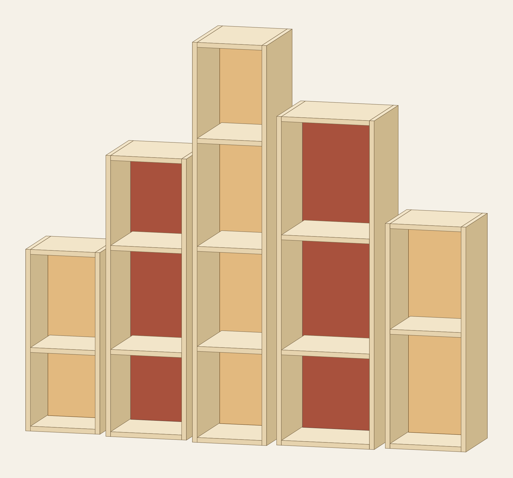

# TIDELINE / 01

A bookcase shaped like a shoreline. Five towers rise to a narrow peak, then fall into a wider ledge. Warm birch edges frame two fields of clay red. The spaces between the towers give the piece its rhythm.


The room image is an AI-generated concept view. The panel model below defines the cut geometry.



## The piece

Overall: **1,664 W × 360 D × 1,480 H mm**. Clear gaps: **32 mm**. Towers share a back plane; their front edges step in depth.

| Tower, left to right | Width | Height | Depth | Internal shelves | Back finish |
|---|---:|---:|---:|---:|---|
| 1 | 280 | 672 | 288 | 1 | Clear matte |
| 2 | 304 | 1,040 | 324 | 2 | Clay red |
| 3 | 280 | 1,480 | 360 | 3 | Clear matte |
| 4 | 368 | 1,216 | 338.4 | 2 | Clay red |
| 5 | 304 | 832 | 302.4 | 1 | Clear matte |

All dimensions are in millimetres. The frame uses 18 mm Baltic birch plywood with exposed edges. The backs use 6 mm plywood in grooves. The two painted backs use a clay-red colour reference, `#A8513D`; choose a physical paint sample under the room's light. Finish the other panels with clear matte varnish. The cut list carries the finish notes for each part.

The piece has 34 panels, 30 distinct panel types and 22 assembly steps. The default cut layout uses three 1,525 × 1,525 mm birch sheets and one 2,440 × 1,220 mm back sheet. Estimated panel weight is 67.8 kg.

Each tower uses cam locks and dowels. Its back braces the frame. Each tower needs its own wall fixing; the hardware list includes five anti-tip kits. Have the shop confirm board thickness, fittings and machining with a sample joint before cutting the full kit. Physical load testing remains part of the prototype build.

## Make your version

Choose **Tideline** in the workshop. Adjust the width, height, depth, gap, finish and joinery. Save the design, then choose **Build my kit** for DXFs, cut lists, hardware, preview drawings, shop notes and assembly steps.

The same piece can be created from the saved recipe:

```sh
npm run build
node dist/cli.js design tideline examples/tideline.json --name "TIDELINE / 01 — Clay & Birch" --build
```

The [room-view prompt](room-prompt.md) records how the concept image was made from the panel model.
